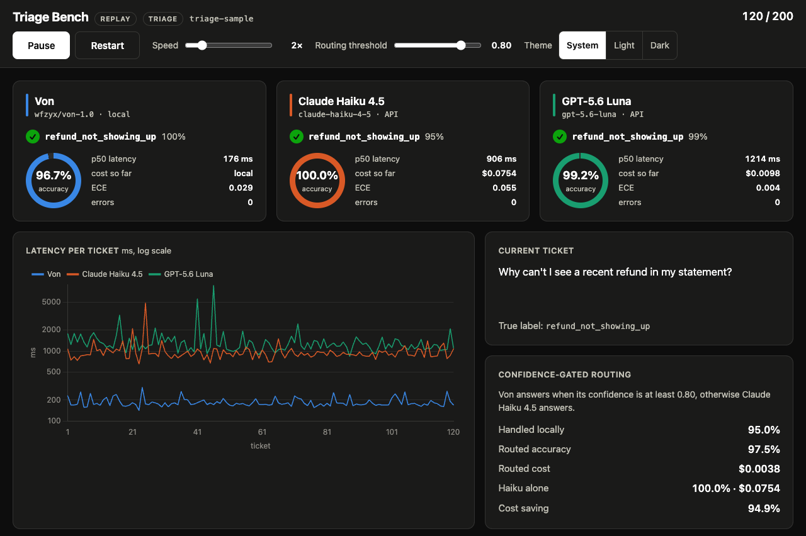
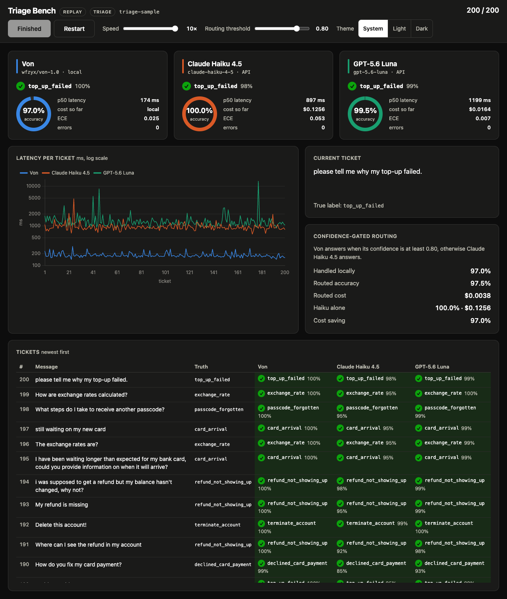
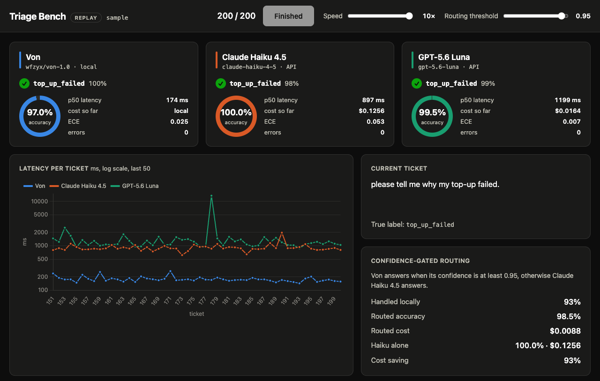
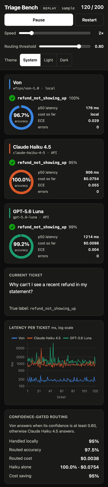

# Triage Bench

A local System One decision model against two hosted LLMs on 8-way support-ticket intent triage, streamed ticket by ticket to a live dashboard.



## Contestants

| contestant | model | runs | price per 1M tokens (in / out) |
|---|---|---|---|
| Von | [`wfzyx/von-1.0`](https://huggingface.co/wfzyx/von-1.0) (`von-sdk` 1.0.1) | locally | free |
| Claude Haiku 4.5 | `claude-haiku-4-5` | Anthropic API | $1.00 / $5.00 |
| GPT-5.6 Luna | `gpt-5.6-luna` | OpenAI API | $0.20 / $1.20 |

Von is an open-source 395M ModernBERT System One model (returns a choice plus probabilities, no text generation), standing in for TypeSafe's Jev, whose signups are closed.

## Results

200 Banking77 tickets, 2026-09-22, Apple M2 16 GB (Von on MPS), total API cost ≈ $0.14, 0 errors. `uv run triage-bench report`:

```
| contestant | accuracy | p50 ms | p95 ms | cost | ECE |
|---|---|---|---|---|---|
| von | 97.0% | 174 | 244 | $0.0000 | 0.025 |
| haiku | 100.0% | 897 | 1243 | $0.1256 | 0.053 |
| luna | 99.5% | 1199 | 1941 | $0.0164 | 0.007 |

Routing at threshold 0.80: von handled 97% locally, rest to haiku.
  routed:   accuracy 97.5%, cost $0.0038
  haiku alone: accuracy 100.0%, cost $0.1256
  cost saving: 97%
```

ECE is expected calibration error: lower is better. Routing keeps Von's answer when its confidence is at least the threshold, otherwise uses Haiku's.

## Quick start: replay (no keys)

```bash
git clone https://github.com/ruidpm/triage-bench && cd triage-bench
uv sync
uv run triage-bench replay        # open http://127.0.0.1:8000, press Start
```

`uv sync` installs PyTorch (Von's dependency), about 800 MB in total.

## Quick start: live

```bash
cp .env.example .env              # fill in ANTHROPIC_API_KEY and OPENAI_API_KEY
uv run --env-file .env triage-bench live
```

- The Anthropic key must be scoped to a workspace; an unscoped key fails with a 400 asking for `anthropic-workspace-id`.
- The first run downloads Von's weights (~1.6 GB) to `~/.cache/huggingface/hub/`; remove them with `uv run hf cache rm model/wfzyx/von-1.0`.
- Open the page in one tab only: each stream connection starts a new, paid run. Results go to `runs/<timestamp>.jsonl`.
- Own tickets: `--tickets file.csv` with header `id,text,label`, labels from `src/triage_bench/domain/ticket.py`.

## Screenshots

| Finished run | Threshold at 0.95 | Phone (390 px) |
|---|---|---|
|  |  |  |

## Fairness

- Same instruction and label descriptions for every contestant.
- LLMs: structured output `{label, confidence}`, no thinking, no tools, 64 max tokens.
- Latency is client-side wall clock per call; Von's model load is excluded.
- SDK auto-retries off, so rate limits show as errors, not inflated latency.
- Cost from each API's reported token counts.
- Same ticket order, sequential calls, all three answer before the next ticket.

## Caveats

- Von is a stand-in; nothing here measures Jev.
- Von's model card cites ~18 ms on GPU; this laptop measured 174 ms p50.
- LLM confidence is self-reported, not a computed probability.
- 200 tickets on 8 intents is a demo; no significance testing.
- Live API latency includes your network.

## Development

```bash
uv sync --all-groups
uv run pytest
uv run ruff check .
uv run mypy src
```

## Licence and attribution

MIT. Tickets sampled from [Banking77](https://github.com/PolyAI-LDN/task-specific-datasets) by PolyAI, CC BY 4.0:

```bibtex
@inproceedings{Casanueva2020,
  author    = {I{\~{n}}igo Casanueva and Tadas Temcinas and Daniela Gerz and Matthew Henderson and Ivan Vulic},
  title     = {Efficient Intent Detection with Dual Sentence Encoders},
  year      = {2020},
  booktitle = {Proceedings of the 2nd Workshop on NLP for ConvAI - ACL 2020},
  url       = {https://arxiv.org/abs/2003.04807}
}
```

Von (`wfzyx/von-1.0`, `von-sdk`) by wfzyx, Apache-2.0.
